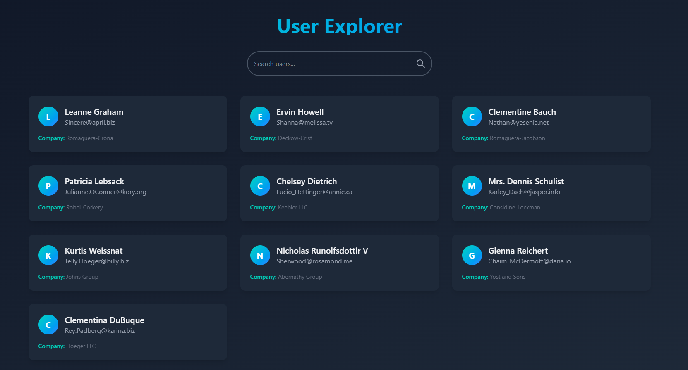
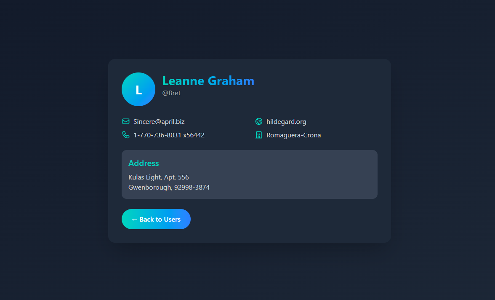

# 📘 User Directory

A simple and elegant user directory web application built with React, Tailwind CSS, and Framer Motion. It fetches user data from an API and allows searching and viewing user details.

## 🚀 Live Demo

🔗 Live Link (Replace with your deployment URL)

## 📸 Screenshots

### Homepage



### User Details Page



## 🛠 Tech Stack

- React.js ⚛️
- Tailwind CSS 🎨
- Framer Motion 🎞️
- Axios 📡
- React Router 🌐

## 🔧 Features

- Fetches user data from an API
- Search functionality to filter users
- Smooth animations with Framer Motion
- Responsive and modern UI

## 📂 Folder Structure

```
/src
│-- /pages
│   ├── Home.jsx
│   ├── Details.jsx
│   ├── Layout.jsx
│-- /components
│-- App.jsx
│-- index.js
```

## 📦 Installation & Setup

1. Clone the repository
   ```bash
   git clone https://github.com/Anuj579/react-api-app.git
   cd user-directory
   ```
2. Install dependencies
   ```bash
   npm install
   ```
3. Start the development server
   ```bash
   npm run dev
   ```

---

Made with ❤️ by Anuj
